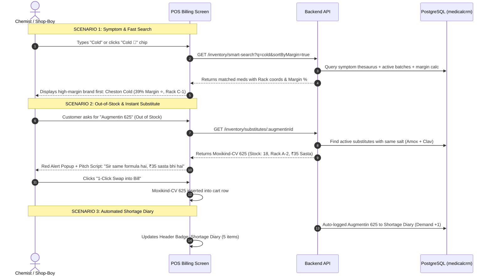

# Frontend Developer Guide: APIs, UI Workflow & Fallback Architecture

**Base API URL:** `http://134.195.138.153:5095/api/v1`  
**Authentication Header:** `Authorization: Bearer <jwt_token>`  
**Shop Context:** Automatically extracted from JWT token or passed via `x-shop-id` header.

---

## 1. Architectural Workflow & Chemist User Experience



---

## 2. API Endpoints Specification

### 2.1. Symptom-Based Smart Search
**Endpoint:** `GET /inventory/smart-search`

#### Query Parameters:
| Parameter | Type | Required | Default | Description |
|---|---|---|---|---|
| `q` | string | No | `""` | Search query (e.g. `"Cold"`, `"Gas"`, `"Fever"`, or medicine name `"Augmentin"`) |
| `symptomOnly` | boolean | No | `false` | When `true`, matches only symptom tags |
| `inStockOnly` | boolean | No | `false` | When `true`, filters out items with 0 stock |
| `sortByMargin` | boolean | No | `false` | When `true`, ranks highest profit margin first |
| `limit` | number | No | `50` | Maximum results to return |

#### Request Example:
```http
GET /api/v1/inventory/smart-search?q=Cold&sortByMargin=true HTTP/1.1
Host: 134.195.138.153:5095
Authorization: Bearer <token>
```

#### Response Example (200 OK):
```json
{
  "success": true,
  "data": {
    "query": "cold",
    "detectedSymptom": "cold",
    "totalMatches": 4,
    "items": [
      {
        "id": "00000000-0000-0000-0000-000000000004",
        "name": "Cheston Cold Tablet",
        "genericName": "Cetirizine + Phenylephrine + Paracetamol",
        "brand": "Cipla",
        "dosageForm": "Tablet",
        "strength": "Standard",
        "symptoms": "Cold, Sardi, Runny Nose, Sneezing, Nasal Congestion, Watery Eyes",
        "saltComposition": "Cetirizine (5mg) + Phenylephrine (10mg) + Paracetamol (325mg)",
        "mrp": 64.00,
        "sellingPrice": 64.00,
        "purchaseRate": 39.04,
        "marginPercent": 39,
        "isHighMargin": true,
        "totalStock": 20,
        "stockStatus": "IN_STOCK",
        "location": {
          "rack": "C",
          "shelf": "1",
          "box": "05",
          "formatted": "Rack C • Shelf 1 • Box 05"
        },
        "category": "OTC & General",
        "manufacturer": "Cipla Ltd",
        "packing": "Tablet",
        "batchesCount": 1,
        "batches": [
          {
            "id": "batch-1",
            "batchNumber": "CHST-882",
            "expiryDate": "2028-09-15T00:00:00.000Z",
            "currentQuantity": 20,
            "mrp": 64.00,
            "sellingPrice": 64.00
          }
        ]
      },
      {
        "id": "00000000-0000-0000-0000-000000000005",
        "name": "Sinarest New Tablet",
        "genericName": "Chlorpheniramine + Phenylephrine + Paracetamol",
        "brand": "Centaur",
        "dosageForm": "Tablet",
        "strength": "Standard",
        "symptoms": "Cold, Headache, Fever, Bodyache, Blocked Nose",
        "saltComposition": "Paracetamol (500mg) + Phenylephrine (10mg) + Chlorpheniramine (2mg)",
        "mrp": 76.00,
        "sellingPrice": 76.00,
        "purchaseRate": 62.32,
        "marginPercent": 18,
        "isHighMargin": false,
        "totalStock": 30,
        "stockStatus": "IN_STOCK",
        "location": {
          "rack": "C",
          "shelf": "1",
          "box": "06",
          "formatted": "Rack C • Shelf 1 • Box 06"
        },
        "category": "OTC & General",
        "batchesCount": 1
      }
    ]
  }
}
```

---

### 2.2. Instant Salt-Equivalent / Substitute Engine
**Endpoint:** `GET /inventory/substitutes/:medicineId`

#### Path Parameter:
- `medicineId`: UUID of the requested medicine.

#### Request Example:
```http
GET /api/v1/inventory/substitutes/00000000-0000-0000-0000-000000000001 HTTP/1.1
Host: 134.195.138.153:5095
Authorization: Bearer <token>
```

#### Response Example (200 OK):
```json
{
  "success": true,
  "data": {
    "targetMedicine": {
      "id": "00000000-0000-0000-0000-000000000001",
      "name": "Augmentin 625 Duo Tablet",
      "genericName": "Amoxicillin + Clavulanic Acid 625mg",
      "mrp": 203.50,
      "totalStock": 0,
      "isOutOfStock": true,
      "rack": "A",
      "shelf": "2",
      "box": "08",
      "locationFormatted": "Rack A • Shelf 2 • Box 08"
    },
    "substitutesCount": 1,
    "inStockSubstitutesCount": 1,
    "substitutes": [
      {
        "id": "00000000-0000-0000-0000-000000000002",
        "name": "Moxikind-CV 625 Tablet",
        "genericName": "Amoxicillin + Clavulanic Acid 625mg",
        "brand": "Mankind Pharma",
        "saltComposition": "Amoxicillin (500mg) + Clavulanic Acid (125mg)",
        "manufacturer": "Mankind Pharma Ltd",
        "dosageForm": "Tablet",
        "mrp": 168.00,
        "sellingPrice": 168.00,
        "totalStock": 18,
        "stockStatus": "IN_STOCK",
        "priceDifference": 35.50,
        "isCheaper": true,
        "savingsAmount": 35.50,
        "pitchScript": "Sir same formula hai (Amoxicillin + Clavulanic Acid 625mg), ₹36 sasta bhi hai!",
        "marginPercent": 32,
        "isHighMargin": true,
        "location": {
          "rack": "A",
          "shelf": "2",
          "box": "09",
          "formatted": "Rack A • Shelf 2 • Box 09"
        },
        "eligibleBatch": {
          "id": "batch-moxikind",
          "batchNumber": "MKCV-902",
          "expiryDate": "2028-09-15T00:00:00.000Z",
          "currentQuantity": 18,
          "mrp": 168.00,
          "sellingPrice": 168.00
        }
      }
    ]
  }
}
```

---

### 2.3. Shortage Diary (Kami Register / Want Book)

#### 2.3.1. List Shortage Diary
**Endpoint:** `GET /inventory/shortage-diary`  
**Query Params:** `status` (`PENDING`, `PO_CREATED`, `RESOLVED`, `DISMISSED`) - optional

#### Response Example (200 OK):
```json
{
  "success": true,
  "data": {
    "total": 2,
    "items": [
      {
        "id": "shortage-uuid-1",
        "medicineId": "00000000-0000-0000-0000-000000000001",
        "medicineName": "Augmentin 625 Duo Tablet",
        "genericName": "Amoxicillin + Clavulanic Acid 625mg",
        "manufacturer": "GSK",
        "packing": "Tablet",
        "currentStock": 0,
        "customerCount": 5,
        "suggestedReorderQty": 30,
        "lastRequestedAt": "2026-09-15T10:35:00.000Z",
        "status": "PENDING",
        "notes": "High customer counter demand (Out of stock)",
        "preferredSupplier": {
          "id": "supp-uuid",
          "name": "Apex Pharma Distributors",
          "mobile": "+91 98111 22233",
          "contactPerson": "Ramesh Gupta"
        },
        "mrp": 203.50,
        "purchaseRate": 162.80,
        "rackLocation": "Rack A • Shelf 2"
      }
    ]
  }
}
```

#### 2.3.2. Log / Increment Shortage Item
**Endpoint:** `POST /inventory/shortage-diary/log`

#### Request Body:
```json
{
  "medicineId": "00000000-0000-0000-0000-000000000001",
  "customerCount": 1,
  "notes": "Walk-in customer demanded"
}
```

#### 2.3.3. Update Shortage Item Status
**Endpoint:** `PATCH /inventory/shortage-diary/:id`

#### Request Body:
```json
{
  "status": "PO_CREATED",
  "suggestedReorderQty": 40,
  "notes": "Ordered 40 strips from Apex Pharma"
}
```

---

## 3. UI Display & Component Guidelines for Frontend

### 3.1. Symptom Quick Filter Chips
Place these clickable chips directly above the item search input in POS Billing:
- `All`
- `Cold & Flu 🤧` (sends `q=Cold`)
- `Gas & Acidity 🫧` (sends `q=Gas`)
- `Fever & Pain 🌡️` (sends `q=Fever`)
- `Cough 🫁` (sends `q=Cough`)
- `Vomiting 🤢` (sends `q=Vomiting`)
- `Diarrhea 💧` (sends `q=Diarrhea`)
- `Allergy 🌿` (sends `q=Allergy`)

### 3.2. Visual Margin Badges
Display next to the product price:
- If `marginPercent >= 25`:
  ```html
  <span class="badge-high-margin" style="background:#ECFDF5; color:#065F46; border:1px solid #A7F3D0; padding:2px 6px; border-radius:4px; font-weight:700; font-size:0.75rem;">
    ⭐ {marginPercent}% Margin
  </span>
  ```
- If `marginPercent < 25`:
  ```html
  <span style="background:#F1F5F9; color:#475569; padding:2px 6px; border-radius:4px; font-weight:600; font-size:0.75rem;">
    {marginPercent}% Margin
  </span>
  ```

### 3.3. Visual Rack & Shelf Locator
Render with a distinct blue/teal locator chip:
```html
<span style="background:#EFF6FF; color:#1D4ED8; border:1px solid #BFDBFE; padding:2px 6px; border-radius:4px; font-weight:600; font-size:0.75rem;">
  📍 {location.formatted || "Rack " + rack + " • Shelf " + shelf}
</span>
```

### 3.4. Color-Coded Stock Status
- `totalStock > 5` ➔ 🟢 **In Stock ({totalStock})** (`#059669`)
- `totalStock >= 1 && totalStock <= 5` ➔ 🟠 **Low Stock ({totalStock})** (`#D97706`)
- `totalStock === 0` ➔ 🔴 **Khatam / Out of Stock** (`#DC2626`)

### 3.5. Instant Salt-Equivalent Red Alert & Swap Action
When an item with `totalStock === 0` is clicked:
1. Don't block the chemist; immediately fetch `GET /inventory/substitutes/:id`.
2. Display the Substitute Alert Modal or Inline Banner:
   - **Header:** `⚠️ {targetMedicine.name} is Out of Stock!`
   - **Recommendation:** `👉 {substitute.name} (Qty: {substitute.totalStock}, {substitute.location.formatted})`
   - **Formula:** `Same Salt: {substitute.genericName}`
   - **Chemist Pitch:** `"{substitute.pitchScript}"`
   - **Button:** `[⚡ 1-Click Swap into Bill]`
3. On clicking "Swap into Bill":
   - Insert `substitute` and its first eligible batch into the current cart row.
   - Close modal and play confirmation sound/toast.

---

## 4. Frontend Fallback Strategy (Crash-Proof Architecture)

> [!IMPORTANT]
> The frontend should NEVER break even if the backend is down, slow, or database values are missing.

1. **Missing Location Fallback:**
   ```ts
   const rackStr = item.location?.formatted 
     || `Rack ${item.rack || "A"} • Shelf ${item.shelf || "1"} • Box ${item.box || "01"}`;
   ```

2. **Missing Margin Fallback:**
   ```ts
   const margin = typeof item.marginPercent === "number"
     ? item.marginPercent
     : item.sellingPrice && item.purchaseRate
       ? Math.round(((item.sellingPrice - item.purchaseRate) / item.sellingPrice) * 100)
       : 20; // safe default
   ```

3. **Client-side Symptom Search Fallback:**
   If `smart-search` API encounters an error or network drop:
   - The UI automatically falls back to client-side filtering over the cached `medicines` array using the embedded symptom keyword mapping so billing is **never blocked**.
